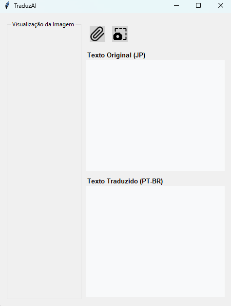

# TraduzAI



Tradutor offline de japonês para português brasileiro, integrando OCR e IA para jogos/visual novels.

## 🚀 Recursos

- **Tradução em tempo real** (digitação manual ou via OCR)
- **Captura de tela inteligente** (Windows + Shift + S)
- **100% offline** (modelos locais)
- Suporte a fontes de jogos japonesas

## 📦 Instalação

### Pré-requisitos

- Python 3.11+
- [Tesseract OCR 5.3+](https://github.com/UB-Mannheim/tesseract/wiki) com dados em japonês
- NVIDIA GPU (recomendado) ou CPU

```bash
# Clone o repositório
git clone https://github.com/seu-usuario/TraduzAI.git
cd TraduzAI

# Instale as dependências
pip install -r requirements.txt --extra-index-url https://download.pytorch.org/whl/cu118
```

## 🖥 Como Usar

Inicie o aplicativo:

```bash
python main.py
```

Tradução de Imagens:

Clique no botão de pasta para selecionar imagem (.png/.jpg)

Ou use o botão de câmera para captura de tela (Win+Shift+S)

Tradução Manual:

Digite/copie texto japonês na área "Original"

A tradução aparecerá automaticamente após 0.5s

Atalhos:

Ctrl + S: Salvar tradução

Ctrl + C: Copiar texto traduzido

## ⚙ Configuração

Ajuste de Performance
Edite modules/translation.py:

```python
# Para GPUs NVIDIA:

model = MarianMTModel.from_pretrained(..., device_map="auto", torch_dtype=torch.float16)
# Para CPUs:

model = MarianMTModel.from_pretrained(..., device_map="cpu")
```

Caminho do Tesseract
No final de main.py:

```python
pytesseract.pytesseract.tesseract_cmd = r'SEU_CAMINHO_AQUI\tesseract.exe'
```

## 🐛 Solução de Problemas

#### Erro Comum + Solução:

"Tesseract not found" -> Verifique o caminho no main.py \
"CUDA out of memory" -> Reduza o tamanho das imagens \
"No module named..." -> Reinstale os requisitos \
Traduções lentas -> Use o modelo opus-mt-ja-pt

## 📄 Licença

MIT License - LICENSE

## 🙌 Contribuição

Contribuições são bem-vindas! Abra uma issue ou pull request para:

Melhorar a precisão do OCR

Adicionar novos modelos de tradução

Otimizar a interface gráfica

🌟 Estrelas
Se este projeto te ajudou, deixe uma ⭐ no GitHub!

###### Nota: Projeto otimizado para Windows 11. Para Linux/macOS, ajuste os comandos de captura de tela.
